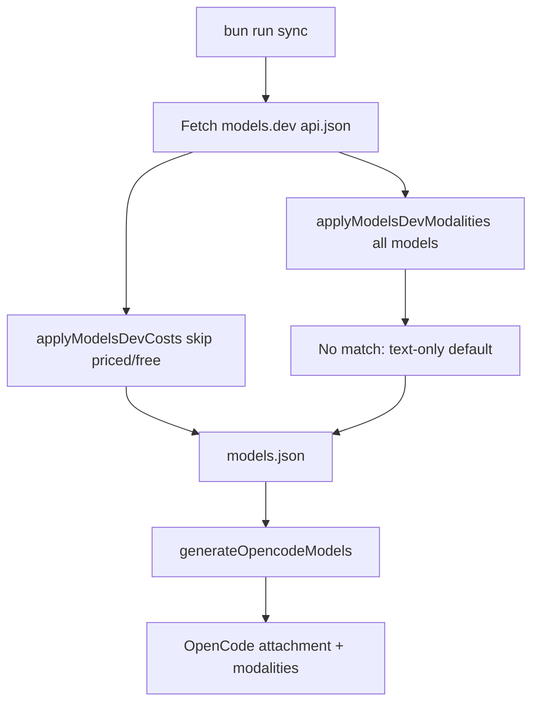

# Spec: Catalog modalities from models.dev

Status: approved (2026-08-28)
**Branch:** `feature/2026-08-28-catalog-modalities`

Parent: [docs/2026-08-28-ci-catalog/spec.md](../2026-08-28-ci-catalog/spec.md)

## Goals

- G1: Every bundled catalog model carries OpenCode `attachment` and `modalities` copied from [models.dev](https://models.dev).
- G2: Unmatched models default to text-only (no vision guessing, no frozen allowlist).
- G3: Cost waterfall stays independent; modalities apply to all matching models including free SKUs.

## Locked (do not reopen)

- Source of truth is models.dev `attachment` + `modalities` (same fetch already used for costs). No human allowlist. No guessing vision.
- Cost waterfall stays independent. Modalities apply to **all** matching models, including free SKUs and models that already have CLI/docs prices.
- Unmatched models default to text-only: `attachment: false`, `modalities: { input: ["text"], output: ["text"] }`.
- Runtime still does not fetch models.dev. Sync writes the fields into `models.json`; `generateOpencodeModels` emits them (and the text-only default if a field is missing).
- Do not overwrite CLI `limit`, `reasoning`, or `tool_call` from models.dev.
- Do not inject capability text into the session prompt. Asking the chat model “what can you do?” is out of scope.

## Context

`generateOpencodeModels` currently emits `id`, `name`, `reasoning`, `tool_call`, `cost`, `limit`, and optional `reasoningEfforts`/`variants`. OpenCode uses `attachment` and `modalities.input` for vision. Hy4 Preview (`tencent/hy4-preview`) is text-only on models.dev with a 1,048,576 context window already present on `limit`; the model itself does not read that metadata.

## Non-goals

- Session/system-prompt injection of context window or vision flags
- Filling `limit` from models.dev
- Local OpenCode overlay `commandcode-modalities.ts` (becomes redundant after this ships; not deleted in this repo)
- Changing hybrid Provider API transport

## Architecture

Matching reuses the existing models.dev index: exact id, then last path segment, then display name (case-insensitive). Copy `modalities` arrays as-is (Gemini may include `video` / `audio` / `pdf`). `attachment` comes from models.dev when present, otherwise `modalities.input` includes `"image"`.

## Acceptance criteria

- CA-01: `parseModelsDev` retains `attachment` and `modalities` on rows that already have costs.
- CA-02: `applyModelsDevModalities` sets Gemini-style vision on a matching catalog id and text-only on Hy4 Preview / unmatched ids.
- CA-03: Free SKUs and CLI-priced models still receive modalities (not skipped the way costs are).
- CA-04: `generateOpencodeModels` always emits `attachment` and `modalities`; missing fields become text-only.
- CA-05: `bun run sync` applies modalities from the same models.dev JSON used for costs; if that fetch fails, every model still gets the text-only default before write.
- CA-06: README states that vision/text-only comes from models.dev.

## Decisions

- D-01: Conservative default is text-only, not “omit the field and let OpenCode guess”.
- D-02: Extra modality strings from models.dev are copied, not filtered to `text`/`image`.
